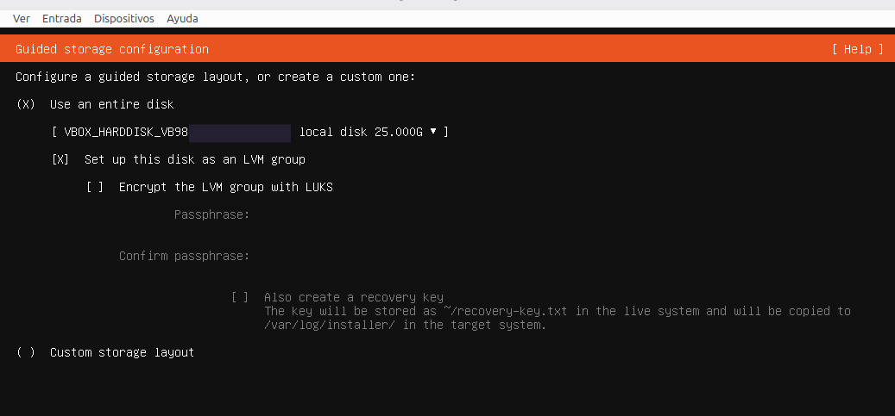
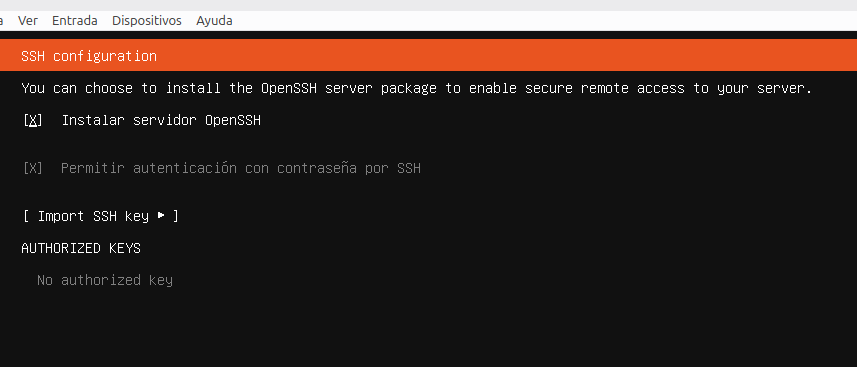

# Configuracion de VirtualBox

Antes de iniciar el instalador del sistema operativo, es fundamental preparar correctamente el entorno virtualizado. Para este laboratorio enfocado en Sysadmin y Ciberseguridad defini los siguientes parametros de hardware y de red. 

## Asignacion de recursos de hardware 
*   **Memoria Ram:** 2048 MB (2 GB) - *Suficiente para un entorno de servidor sin interfaz grafica (CLI)*

*   **Procesadores (vCPUs):** 2 vCPUs - *Para garantizar fluidez al compilar o correr contenedores Docker mas adelante*

*   **Disco Rigido:**  (25 GB) - *(Formato VDI reservado dinamicamente)*

 

## Configuracion de la interfaz de red 

Para este laboratorio se utilizara en primera instancia **NAT (Network Address Translation)** en la cual podemos proteger el servidor mientras lo configuramos en un esquema de direccion virtual que actua como un Firewall básico. Puede iniciar conexión al exterior (permitiendo actualizar el sistema mediante `apt`), pero no acepta trafico entrante no solicitado desde mi red local fisica. La conexion SSH inicial sera por reenvio de puertos de la maquina anfitriona al servidor. Mas adelante tambien se utilizara **Red NAT** para poder administrar el servidor desde otro dispositivo en la misma red.   

# Instalacion del sistema operativo

Una vez iniciada la máquina virtual, el instalador de Ubuntu nos guiará por una serie de menús interactivos. A continuación, se detallan los pasos clave:

1. **Idioma y Teclado:** Configuro el idioma del instalador. Aunque en entornos de producción los servidores se instalan casi siempre en **Inglés** (para facilitar la lectura de logs y la solución de errores), la distribución del teclado debe coincidir con el teclado físico. En este laboratorio selecciono **Spanish (Latin American)** para mantener la fluidez al escribir comandos con caracteres especiales (`/`, `|`, `$`).

2. **Actualización del Instalador:** El sistema nos notificará si existe una nueva versión del instalador en GitHub. Elegimos **"Continue without updating"** para agilizar el proceso. Las actualizaciones del sistema operativo las realizaremos de forma controlada más adelante mediante `apt`.

3. **Tipo de Instalación:** Elegimos *Ubuntu Server* (la versión base, sin paquetes extra).

4. **Red:** El instalador detectará automáticamente la IP por DHCP gracias al modo NAT de VirtualBox. Dejamos tal cual se asigna por defecto; más adelante se asignará una IP estática, 

5. **Proxy Address:** Dejamos este campo en blanco

6. **Configuración de Almacenamiento (Guided Storage Configuration):**
   * Seleccionamos **"Use an entire disk"** para que el sistema utilice los 25 GB que le asignamos en VirtualBox.
   * **LVM (Logical Volume Manager):** Dejamos activada la opción *Set up this disk as an LVM group*. Esto nos dará la flexibilidad en el futuro de expandir el almacenamiento del servidor sumando nuevos discos sin necesidad de reinstalar el sistema.
   * **Cifrado (LUKS):** Dejamos desactivada la opción de encriptar el disco para este entorno de pruebas.

    

    

7. **Storage configuration** Veremos la configuracion general y resumen del sistema, procedemos a continuar y siguiente, nos pregunta si estamos seguros de continuar, volvemos a confirmar

8. **profile configuration** creamos  un usuario, nombre de servidor, y contraseña

9. **Ubuntu Pro:** El instalador nos ofrecerá activar el soporte extendido de Ubuntu Pro. Seleccionamos **"Skip for now"** (Omitir por ahora) para continuar con una instalación estándar y limpia. Si es necesario, este servicio se puede activar por consola más adelante.

10. **Configuración de SSH (SSH Setup):**
   * Presionamos la barra espaciadora para activar la opción **[X] Install OpenSSH server**. Esto es fundamental, ya que nos permitirá administrar el servidor de forma remota mediante la terminal.
   * La casilla **[X] Allow SSH password authentication** viene marcada de forma predeterminada. La dejamos así para permitir nuestra primera conexión SSH mediante contraseña, la cual securizaremos más adelante en la sección de Hardening.

  

    

11. **Servicios Adicionales (Featured Server Snaps):** Dejamos sin marcar nada y le damos siguiente. Luego comezara la instalacion del sistema operativo