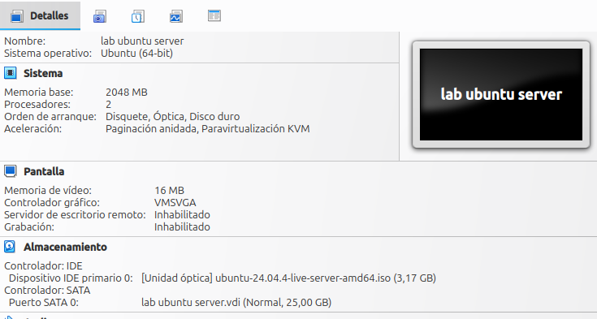

# Configuracion de VirtualBox

Antes de iniciar el instalador del sistema operativo, es fundamental preparar correctamente el entorno virtualizado. Para este laboratorio enfocado en Sysadmin y Ciberseguridad defini los siguientes parametros de hardware y de red. 

## Asignacion de recursos de hardware 
*   **Memoria Ram:** 2048 MB (2 GB) - *Suficiente para un entorno de servidor sin interfaz grafica (CLI)*

*   **Procesadores (vCPUs):** 2 vCPUs - *Para garantizar fluidez al compilar o correr contenedores Docker mas adelante*

*   **Disco Rigido:**  (25 GB) - *(Formato VDI reservado dinamicamente)*

 

## Configuracion de la interfaz de red 

Para este laboratorio se utilizara en primera instancia **NAT (Network Address Translation)** en la cual podemos proteger el servidor mientras lo configuramos en un esquema de direccion virtual que actua como un Firewall básico. Puede iniciar conexión al exterior (permitiendo actualizar el sistema mediante `apt`), pero no acepta trafico entrante no solicitado desde mi red local fisica. La conexion SSH inicial sera por reenvio de puertos de la maquina anfitriona al servidor. Mas adelante tambien se utilizara **Red NAT** para poder administrar el servidor desde otro dispositivo en la misma red.   