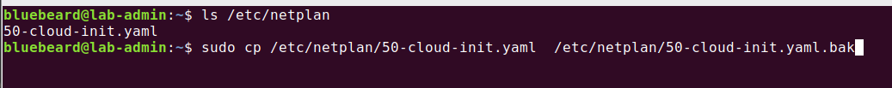
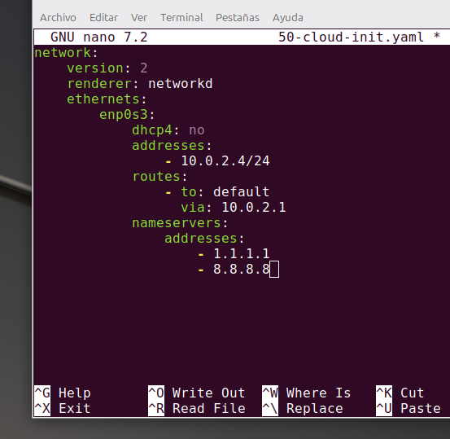
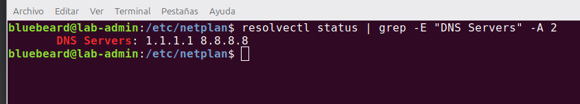
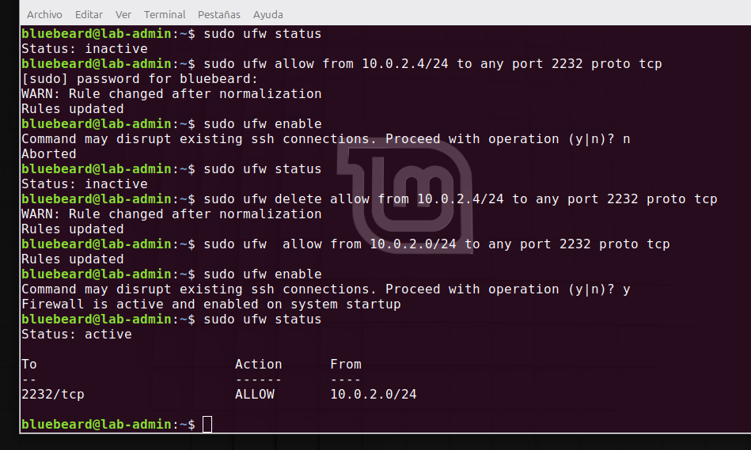
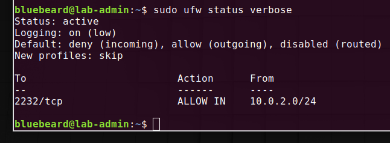
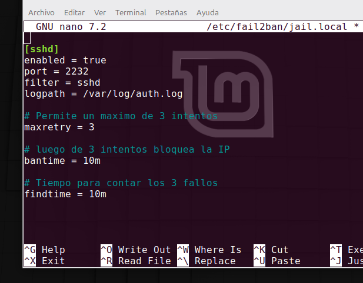
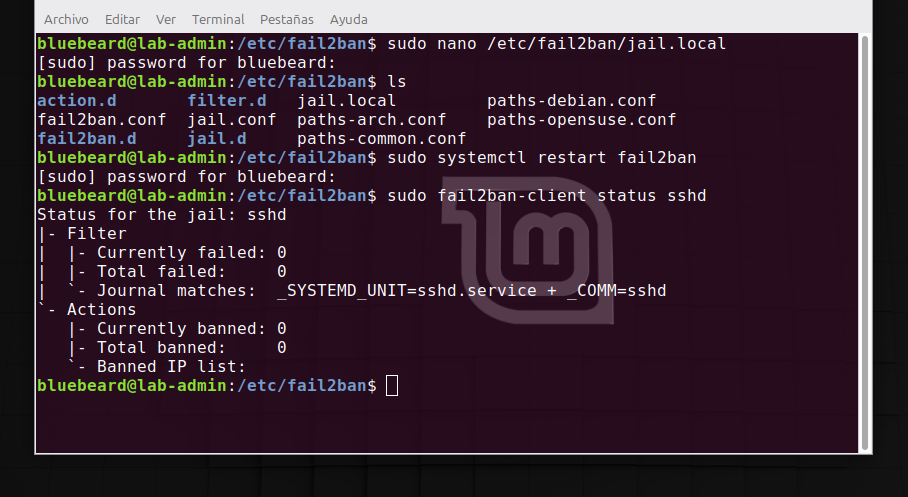

# Configuración de Red y Seguridad Perimetral (Firewall)

En este apartado se documenta el establecimiento de un direccionamiento IP estático, la asignación de servidores DNS seguros y el endurecimiento de la seguridad de red mediante reglas de Firewall (UFW).

## 1. Configuración de IP Estática y DNS mediante Netplan
 
 Primero se debe localizar el archivo dentro de la ruta `/etc/netplan` ejecutamos el comando:
 ```bash
 ls /etc/netplan
 ```
 Una vez localizado el archivo procedemos a realizar una copia del mismo, como paso preventivo. En caso de romper el sistema es importante contar con una copia. Mediante `cp` como se muestra en la imagen mas abajo. 

<br>



   <br>

<br>


   <br>   


Con una copia del archivo **yaml** se procede a modificar el original mediante el comando :

```bash
 sudo nano /etc/netplan/50-cloud-init.yaml
 ```
 
  * **network / version / renderer** son la presentación del archivo, simplemente le avisan al sistema operativo que lo que viene abajo son las ordenes para configurar la tarjeta de red.
  
  * **ethernets /enp0s3** es la forma en que el servidor identifica a nuestra tarjeta de red fisica.

  * **dhcp4: no** : apaga el modo automatico. le prohibe al router que le cambie la IP al servidor de forma aleatoria.

  * **addresses:** es la direccion IP que le asignamos a nuestro servidor, en esta oportunidad se le deja por defecto la que tiene, ya que el archivo de automatizacion para la conexion ssh lo configuramos con esa misma IP. 
  
  * **routes / to: default / via:10.0.2.1** es la puerta de salida le indica a nuestro servidor que cuando quiere buscar algo en internet tiene que salir por esa via.
  
  * **nameservers / addresses / 1.1.1.1 - 8.8.8.8**  son las libretas de direcciones o servidores DNS de Cloudflare y Google.     

Se comparte a continuación una imagen del archivo configurado, una vez completado procedemos a guardar `Ctrol o` damos enter y salimos `Ctrol x` 

<br>



   <br>   

A continuacion ejecutamos el comando `sudo netplan apply`, para finalizar verificamos mediante el comando: 

```bash
 resolvectl status | grep -E "DNS Servers" -A 2
 ```
 Deberia ver lo siguiente:

 <br>



   <br>   


## 2 Configuración de Firewall (UFW) 

Para configurar nuestro firewall primero debemos verificar el estado, ejecutamos el comando : `sudo ufw status` siguiente veremos que su estado es inactivo.

### Politicas por defecto

 Ante de activar nuestro Firewall definimos primero politicas estandar de ciberseguridad básica mediante los siguientes comandos, para denegar todo ingreso y permitir salida a internet :

  ```bash
 sudo ufw default deny incoming
 ```

 ```bash
 sudo ufw default allow outgoing 
 ```

 ### Aplicación de regla

 En nuestro laboratorio cambie por defecto el puerto ssh del 22 al  2232, si activo el Firewall en este momento me expulsaria de la conexion ssh, debido a los dos comando anteriores, antes de encender el Firewall debemos abrir el puerto a la subred mediante el comando :

 ```bash
 sudo ufw allow from 10.0.2.0/24 to any port 2232 proto tcp 
 ``` 

 Finalmente encendemos nuestro Firewall:
 
 ```bash
 sudo ufw enable  
 ``` 

 <br>



   <br>  

 <br>



   <br>    

## 3 Configuración e instalacion de Fail2ban

Aplicar seguridad por capas es fundamental, si bien ya tenemos configurado nuestro **Firewall** ufw que solo permite conexion desde nuestra sub-red, ademas tenemos configurado ssh para conexion por llaves criptograficas y deshabilitado el inicio por contraseña, agregar Fail2ban es fundamental por los siguientes motivos:

 * **1** Detener el consumo de recursos **CPU** y **RAM** aunque un atacante no pueda ingresar sin tener la llave criptografica, genera consulta y consumo de recursos.

  * **2**   Evitar saturar el servidor por saturacion de peticiones **DOS**. En un tercer intento Fail2ban le ordena al Firewall bloquear la IP.
  
  * **3** Evitar spam masivo, evitar que nuestro registro se sature de logs fallidos.


### Paso 1: Instalación del Servicio

Actualizamos los repositorios del sistema e instalamos el paquete nativo de Fail2ban:
```bash
sudo apt update && sudo apt install fail2ban -y
```

Comprobamos que el servicio se encuentre activo y corriendo en la memoria del servidor:
```bash
sudo systemctl status fail2ban
```

### Paso 2: Configuración de la Cárcel Personalizada (sshd)

Bajo las buenas prácticas de administración, nunca se debe modificar el archivo original `jail.conf`, ya que podría sobreescribirse en futuras actualizaciones del programa. En su lugar, creamos un archivo de configuración local:

```bash
sudo nano /etc/fail2ban/jail.local
```

<br>



   <br> 


Guardamos los cambios (`Ctrl + O`, `Enter` y `Ctrl + X`) y reiniciamos el servicio para aplicar la nueva configuración:

```bash
sudo systemctl restart fail2ban
```

### Paso 3: Auditoría y Monitoreo del Estado

Para verificar matemáticamente que Fail2ban se encuentra patrullando activamente la celda de SSH y comprobar si existen IPs bloqueadas en tiempo real, ejecutamos el cliente de control:

```bash
sudo fail2ban-client status sshd
```
<br>



   <br> 

   
