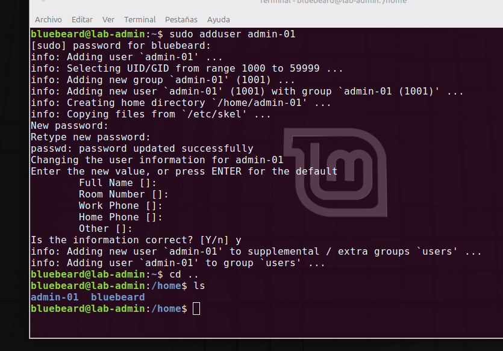
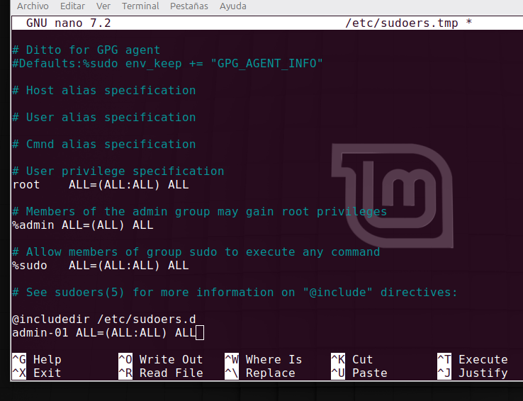

# Hardening Gestión de usuarios y permisos

## 1. Creación de Usuarios y Configuración de Sudo


El primer paso para asegurar nuestro servidor es aplicar el principio de menor privilegio y separación de funciones. Si bien Ubuntu Server bloquea al usuario root de fábrica y nos obliga a usar un usuario principal con capacidades de administración **(bluebeard)**, la buena práctica dicta que debemos segmentar los accesos. Creamos un usuario de administración específico para el laboratorio **(admin-01)** y le otorgamos privilegios de elevación mediante visudo para auditar y separar las tareas cotidianas del control general del sistema.

###  Diferencia técnica: `useradd` vs `adduser`
Al momento de crear un usuario en Ubuntu Server, existen dos comandos que suelen confundirse:
*   **`useradd`:** Es el comando nativo de bajo nivel. Crea el usuario de forma "cruda", lo que significa que no genera su contraseña, ni su directorio en `/home`, ni su entorno de terminal a menos que se lo indiquemos con parámetros manuales avanzados.
*   **`adduser`:** Es un script de alto nivel (asistente interactivo). Automatiza todo el proceso: solicita la contraseña de forma segura, crea la carpeta `/home/usuario`, configura el entorno por defecto (skel) y solicita datos informativos opcionales. Es la opción recomendada y la utilizada en este laboratorio.

###  Comandos ejecutados en el Laboratorio:

1. **Crear el nuevo usuario seguro:**
   ```bash
   sudo adduser admin-01
   ```
   *(El sistema nos pedirá ingresar y confirmar la nueva contraseña, y luego podemos presionar `ENTER` para saltar los campos de datos personales).*   

   <br>



   <br> 

   ###  Otorgar Privilegios de Administrador de forma Segura (`visudo`)

Para que nuestro usuario `admin-01` pueda ejecutar tareas administrativas, debemos registrarlo en el archivo de configuración de sudoers. La práctica recomendada de seguridad dicta que nunca debemos editar este archivo con editores comunes como `nano` o `vim` directamente, ya que un error de sintaxis podría bloquear el acceso `sudo` para todo el sistema.

En su lugar, utilizamos el comando seguro:
```bash
sudo visudo
```
*Este comando abre el archivo en un entorno seguro que verifica que la sintaxis sea correcta antes de guardar los cambios.*

#### Configuración aplicada:
Nos desplazamos hasta el final del archivo y añadimos la siguiente regla para darle control total a nuestro nuevo administrador:

```text
admin-01 ALL=(ALL:ALL) ALL
```

<br>

<br>

Luego `ctrl o` para guardar y `ctrl x` para salir. Nuestro usuario admin-01 ya tiene permiso para utilizar el sudo en sus comandos. 