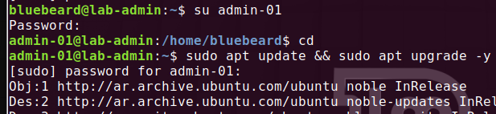
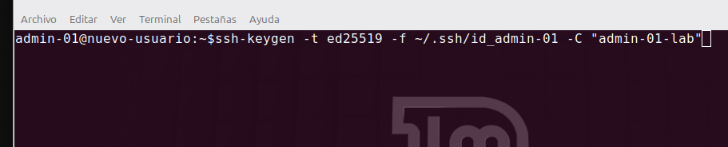
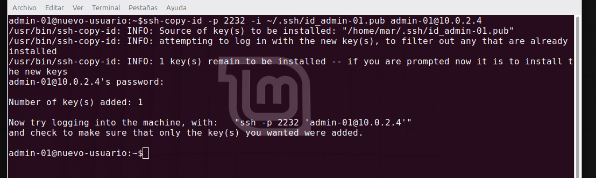
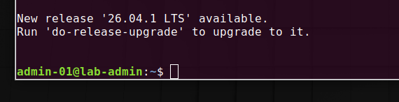

# Hardening Gestión de usuarios y permisos

## 1. Creación de Usuarios y Configuración de Sudo


El primer paso para asegurar nuestro servidor es aplicar el principio de menor privilegio y separación de funciones. Si bien Ubuntu Server bloquea al usuario root de fábrica y nos obliga a usar un usuario principal con capacidades de administración **(bluebeard)**, la buena práctica dicta que debemos segmentar los accesos. Creamos un usuario de administración específico para el laboratorio **(admin-01)** y le otorgamos privilegios de elevación mediante visudo para auditar y separar las tareas cotidianas del control general del sistema.

###  Diferencia técnica: `useradd` vs `adduser`
Al momento de crear un usuario en Ubuntu Server, existen dos comandos que suelen confundirse:
*   **`useradd`:** Es el comando nativo de bajo nivel. Crea el usuario de forma "cruda", lo que significa que no genera su contraseña, ni su directorio en `/home`, ni su entorno de terminal a menos que se lo indiquemos con parámetros manuales avanzados.
*   **`adduser`:** Es un script de alto nivel (asistente interactivo). Automatiza todo el proceso: solicita la contraseña de forma segura, crea la carpeta `/home/usuario`, configura el entorno por defecto (skel) y solicita datos informativos opcionales. Es la opción recomendada y la utilizada en este laboratorio.

###  Comandos ejecutados en el Laboratorio:

1. **Crear el nuevo usuario seguro:**
   ```bash
   sudo adduser admin-01
   ```
   *(El sistema nos pedirá ingresar y confirmar la nueva contraseña, y luego podemos presionar `ENTER` para saltar los campos de datos personales).*   

   <br>


   <br> 

   ###  Otorgar Privilegios de Administrador de forma Segura (`visudo`)

Para que nuestro usuario `admin-01` pueda ejecutar tareas administrativas, debemos registrarlo en el archivo de configuración de sudoers. La práctica recomendada de seguridad dicta que nunca debemos editar este archivo con editores comunes como `nano` o `vim` directamente, ya que un error de sintaxis podría bloquear el acceso `sudo` para todo el sistema.

En su lugar, utilizamos el comando seguro:
```bash
sudo visudo
```
*Este comando abre el archivo en un entorno seguro que verifica que la sintaxis sea correcta antes de guardar los cambios.*

#### Configuración aplicada:
Nos desplazamos hasta el final del archivo y añadimos la siguiente regla para darle control total a nuestro nuevo administrador:

```text
admin-01 ALL=(ALL:ALL) ALL
```

<br>

<br>

Luego `ctrl o` para guardar y `ctrl x` para salir. Nuestro usuario admin-01 ya tiene permiso para utilizar el sudo en sus comandos. 

Por medio del comando `su admin-01` podemos ingresar a nuestro usuario, en la imagen de mi lab pruebo un comando simple de actualización de sistema para verficar que todo funciona de manera correcta.

<br>

<br>

## 2. Gestión de Permisos sobre el Nuevo Usuario

Una vez creado el usuario, es fundamental comprender cómo administra Linux el acceso a los archivos y carpetas bajo su modelo de seguridad de tres capas (Dueño, Grupo, Otros).

###  Estructura de los Permisos en Linux
Cuando ejecutamos un comando de listado detallado (`ls -l`), el sistema nos devuelve una cadena de caracteres a la izquierda que define el tipo de elemento y sus privilegios.

#### 1. Primer carácter (Tipo de elemento):
*   **`-` (Guion):** Identifica que el elemento es un **archivo común** (un texto, una imagen, un script).
*   **`d`:** Identifica que es un **directorio** o carpeta.
*   **`l`:** Identifica que es un **enlace simbólico** (*symlink*), actuando como un acceso directo.

#### 2. Los 9 caracteres siguientes (Bloques de permisos):
Se dividen en tres conjuntos de tres letras (`r` = lectura, `w` = escritura, `x` = ejecución):
*   **Primeros 3:** Permisos para el **Dueño** (User).
*   **Segundos 3:** Permisos para el **Grupo** (Group).
*   **Últimos 3:** Permisos para **Otros** (Others - cualquier usuario fuera de los anteriores).

#### Ejemplo Teórico: El caso `761`
Si tenemos un archivo con la estructura `-rwxrw---x`, se traduce al sistema numérico (octal) sumando los valores asignados a cada propiedad: **Lectura (4), Escritura (2), Ejecución (1)**.

*   **Dueño (`rwx`):** 4 + 2 + 1 = **7** (Tiene control total).
*   **Grupo (`rw-`):** 4 + 2 + 0 = **6** (Puede leer y modificar, pero no ejecutar).
*   **Otros (`--x`):** 0 + 0 + 1 = **1** (Solo puede ejecutar el archivo, no leerlo ni editarlo).


###  Alta de Conexión SSH para el Nuevo Administrador

Una vez creado el nuevo usuario administrador y otorgados sus permisos en `visudo`, el siguiente paso crítico es permitir su acceso remoto mediante **SSH**. Si bien este laboratorio ya cuenta con un apartado general de SSH, considero una excelente práctica documentar cómo se gestionaría este proceso en un entorno corporativo real bajo estándares estrictos de seguridad.

En este escenario simulado, no compartiremos contraseñas. Le solicitaremos al nuevo usuario (**admin-01**) que genere su propio par de claves criptográficas (llave pública y privada) en su dispositivo local mediante el siguiente comando:

```bash
ssh-keygen -t ed25519 -f ~/.ssh/id_admin-01 -C "admin-01-lab"
```

>**Nota de Infraestructura del Lab:** Para simular este comportamiento en nuestro entorno, utilizamos el mismo host físico (Linux Mint) desde donde opera el usuario principal **bluebeard**, actuando en la imaginación como si fuera la computadora externa del nuevo colega. Gracias a los parámetros `-f` (indica el nombre único del archivo) y `-C` (comentario identificatorio), podemos almacenar múltiples llaves de forma ordenada en un mismo cliente SSH sin pisar ni romper nuestras llaves personales previas de GitHub o del propio servidor.

<br>

<br>

###  2. Inyección de la Llave Pública en el Servidor

Para el siguiente paso, el usuario administrador debe transferir de manera segura su "candado" (llave pública) hacia el servidor. Conociendo de antemano la dirección IP estática y el puerto personalizado del servicio SSH de nuestro entorno de VirtualBox, ejecutamos el comando nativo `ssh-copy-id` especificando la ruta exacta de la identidad:

```bash
ssh-copy-id -p 2232 -i ~/.ssh/id_admin-01.pub admin-01@10.0.2.4
```

<br>

<br>

Como se observa en el output de la terminal, el servidor solicita la credencial local del usuario por única vez, procesa la firma criptográfica y confirma la inyección exitosa (`Number of key(s) added: 1`).

###  3. Acceso Directo Seguro

Con la llave pública ya registrada en el archivo `authorized_keys` del servidor, procedemos a realizar la conexión remota desde el cliente. Indicamos de forma explícita qué llave privada utilizar para la autenticación a través del parámetro `-i`:

```bash
ssh -p 2232 -i ~/.ssh/id_admin-01 admin-01@10.0.2.4
```

<br>

<br>

La conexión se establece de forma instantánea. El servidor valida el par de claves y nos otorga **acceso directo a la shell de administración sin pedir contraseñas**, logrando un entorno robusto, eficiente y completamente protegido contra vectores de ataque de fuerza bruta por diccionario.


