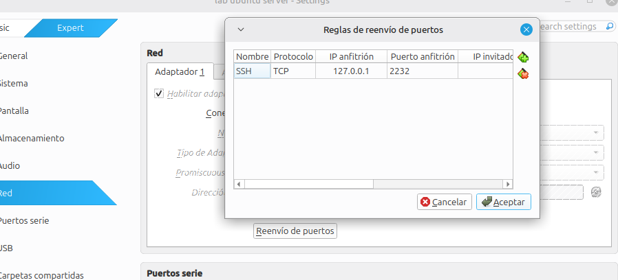
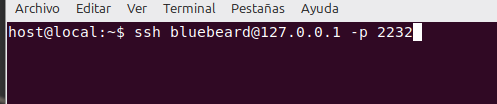
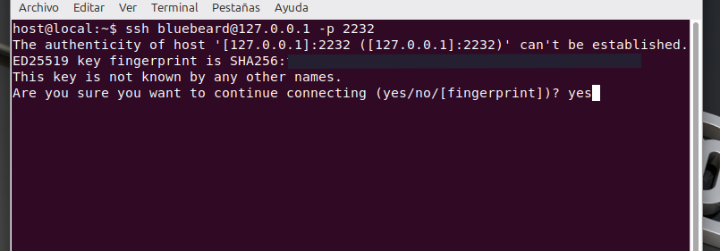
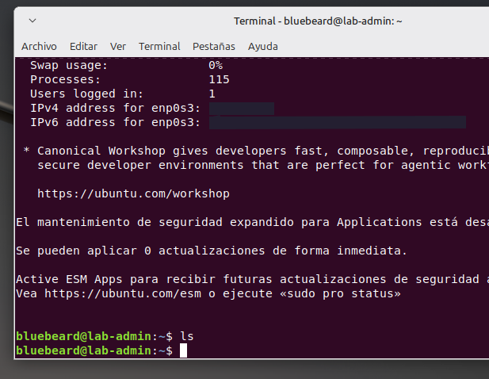

# Conexión remota y auditoria de red

Esta documentacion esta orientada no unicamente a resolver el paso detallado, sino tambien a resolver preguntas que pueden ir surgiendo en el aprendizaje. Por ejemplo 
previo a abrir un puerto para establecer una conexion externa. ¿Qué se encuentra abierto en mi servidor?

## Auditoria inicial de Puertos 

 Se realiza una auditoría de la superficie de ataque base del sistema operativo mediante el comando `sudo ss -tulpn`.

Este comando nos permite verificar qué sockets están escuchando tráfico (`LISTEN` en TCP) o activos en modo no conectado (`UNCONN` en UDP).

Notaremos mediante el comando ejecutado que el puerto 53 de DNS está abierto en IPv4 e IPv6 en escucha (TCP), y además está activo en IPv4 e IPv6 en UDP. Cabe destacar que el protocolo DNS mayoritariamente resuelve dominios de IPs por UDP; sin embargo, cuando la consulta supera el límite de los 512 bytes, es cuando utiliza el protocolo TCP de respaldo. 

Veremos también en UDP el puerto abierto de DHCP para la resolución de la IP privada del servidor y, por último, el puerto 22 abierto tanto en IPv4 como en IPv6 únicamente en TCP (OpenSSH).

## Configuración del Puente de Conexión: Reenvío de Puertos (Port Forwarding)

Sabiendo que el servidor ya tiene el puerto `22` abierto y escuchando en modo TCP, nos enfrentamos a un problema: el servidor se encuentra aislado en la red NAT de VirtualBox, por lo que nuestra máquina anfitriona no puede llegar a él directamente de forma nativa. 

Para solucionar esto y simular una administración remota real, configuramos una regla de **Reenvío de Puertos (Port Forwarding)** en el hipervisor. Esto creará un puente seguro que redirigirá el tráfico desde nuestra PC física hacia el entorno virtualizado.

### Paso 1: Configuración en VirtualBox
Con el servidor encendido o apagado, realizamos los siguientes pasos en la interfaz de VirtualBox:
1. Ir a **Configuración (Settings)** de la máquina virtual ➡️ sección **Red (Network)**.
2. Desplegar las opciones de **Avanzado (Advanced)** y hacer clic en **Reenvío de puertos (Port Forwarding)**.
3. Añadir una nueva regla con el ícono `+` y completar los campos con los siguientes parámetros técnicos:
   * **Nombre:** `SSH`
   * **Protocolo:** `TCP`
   * **IP Anfitrión (Host IP):** `127.0.0.1` *(Dirección de loopback de nuestra PC física).*
   * **Puerto Anfitrión (Host Port):** `2232` *(Puerto libre elegido en la máquina real para evitar conflictos).*
   * **Puerto Invitado (Guest Port):** `22` *(El puerto nativo donde OpenSSH escucha dentro del servidor).*
   * *Nota: Los campos de "IP Invitado" se dejan completamente en blanco.*

  <br>



   <br>

### Paso 2: Conexión Remota desde la Máquina Anfitriona
Una vez aplicada la regla, el puente queda activo. Abrimos una terminal en nuestra computadora física (en mi caso Bash) y ejecutamos el comando de conexión remota apuntando a nuestro puerto puenteado:

```bash
ssh usuario-del-servidor@127.0.0.1 -p 2232
```
<br>



   <br>

#### ¿Qué sucede en el primer inicio?
La primera vez que establezcamos la conexión, OpenSSH nos mostrará una advertencia criptográfica sobre la autenticidad del servidor (`The authenticity of host... can't be established`). 
* Escribimos **`yes`** para confirmar y guardar la firma del servidor en nuestra PC física.

<br>



   <br>

* Introducimos la contraseña de nuestro usuario del servidor y ya habremos tomado el control del servidor de forma remota por SSH.

* En mi caso la primera conexion  despues de ingresar `yes` fallo, reinicie el servidor, volvi a intentar y funciono, automaticamente solicito usuario y contraseña e ingreso.   

<br>



   <br>


## Configuración de VirtualBox: Creación de una Red NAT

Para permitir la comunicación entre dos o más máquinas virtuales, procedemos a crear una **Red NAT** en VirtualBox. 

Por defecto, el modo **NAT** estándar aísla a cada máquina virtual en su propia subred, impidiendo que se conecten entre sí. En cambio, una **Red NAT** funciona como un **switch (conmutador) virtual compartido**: agrupa a ambos dispositivos dentro de la misma subred interna, permitiendo que se comuniquen entre sí (por ejemplo, para administración SSH o auditorías) mientras mantienen su acceso a Internet de forma segura y aislada de la red física local.