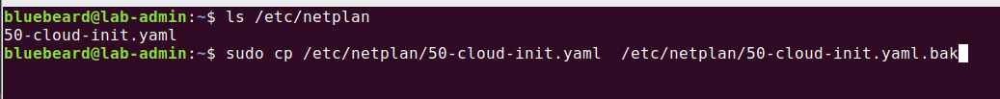
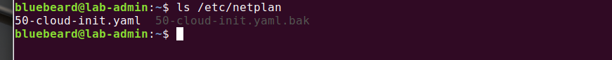
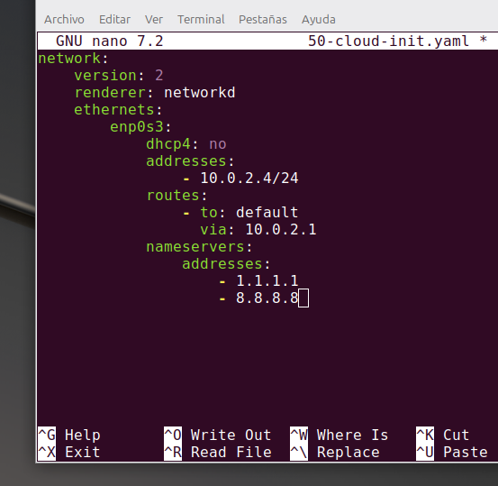
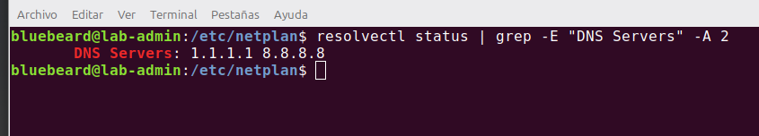

# Configuración de Red y Seguridad Perimetral (Firewall)

En este apartado se documenta el establecimiento de un direccionamiento IP estático, la asignación de servidores DNS seguros y el endurecimiento de la seguridad de red mediante reglas de Firewall (UFW).

## 1. Configuración de IP Estática y DNS mediante Netplan
 
 Primero se debe localizar el archivo dentro de la ruta `/etc/netplan` ejecutamos el comando:
 ```bash
 ls /etc/netplan
 ```
 Una vez localizado el archivo procedemos a realizar una copia del mismo, como paso preventivo. En caso de romper el sistema es importante contar con una copia. Mediante `cp` como se muestra en la imagen mas abajo. 

<br>



   <br>

<br>



   <br>   


Con una copia del archivo **yaml** se procede a modificar el original mediante el comando :

```bash
 sudo nano /etc/netplan/50-cloud-init.yaml
 ```
 
  * **network / version / renderer** son la presentación del archivo, simplemente le avisan al sistema operativo que lo que viene abajo son las ordenes para configurar la tarjeta de red.
  
  * **ethernets /enp0s3** es la forma en que el servidor identifica a nuestra tarjeta de red fisica.

  * **dhcp4: no** : apaga el modo automatico. le prohibe al router que le cambie la IP al servidor de forma aleatoria.

  * **addresses:** es la direccion IP que le asignamos a nuestro servidor, en esta oportunidad se le deja por defecto la que tiene, ya que el archivo de automatizacion para la conexion ssh lo configuramos con esa misma IP. 
  
  * **routes / to: default / via:10.0.2.1** es la puerta de salida le indica a nuestro servidor que cuando quiere buscar algo en internet tiene que salir por esa via.
  
  * **nameservers / addresses / 1.1.1.1 - 8.8.8.8**  son las libretas de direcciones o servidores DNS de Cloudflare y Google.     

Se comparte a continuación una imagen del archivo configurado, una vez completado procedemos a guardar `Ctrol o` damos enter y salimos `Ctrol x` 

<br>



   <br>   

A continuacion ejecutamos el comando `sudo netplan apply`, para finalizar verificamos mediante el comando: 

```bash
 resolvectl status | grep -E "DNS Servers" -A 2
 ```
 Deberia ver lo siguiente:

 <br>



   <br>   