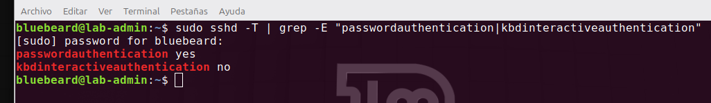
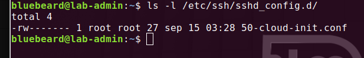
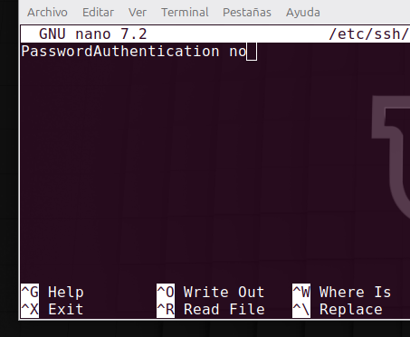
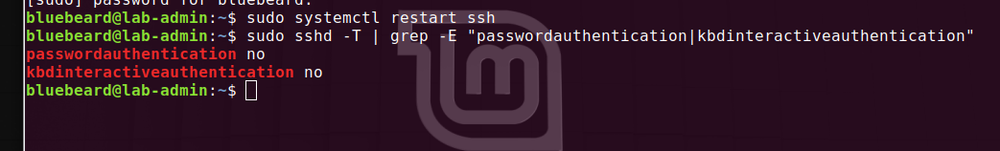
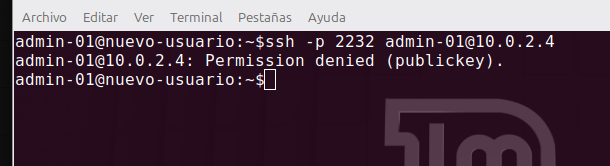

#  Resolución de problemas: El Misterio de la Autenticación por Contraseña Residual en SSH

## El Problema Detectado

Tras configurar de forma estricta la directiva `PasswordAuthentication no` en el archivo principal `/etc/ssh/sshd_config` y reiniciar el servicio, se observó que el servidor **seguía permitiendo el acceso mediante contraseña tradicional** desde el host cliente (Linux Mint), ignorando el bloqueo.

## Diagnóstico Técnico

Para auditar la configuración real en caliente que el servicio OpenSSH estaba aplicando en memoria, ejecutamos el comando de inspección:
```bash
sudo sshd -T | grep -E "passwordauthentication|kbdinteractiveauthentication"
```
<br>



<br>

El sistema arrojó de forma inesperada el valor `passwordauthentication yes`, confirmando la existencia de un *override* (sobreescritura) activo. 

Al inspeccionar el directorio secundario de configuraciones acumulativas, descubrimos el archivo responsable:
```bash
ls -l /etc/ssh/sshd_config.d/
# Resultado: 50-cloud-init.conf
```

<br>



<br>

## Explicación e Impacto Real

En las versiones modernas de Ubuntu Server, la herramienta de despliegue automático `cloud-init` genera de fábrica este archivo secundario. Debido a la jerarquía de lectura de OpenSSH, cualquier directiva dentro de la carpeta `.sshd_config.d/` se procesa **después** del archivo principal, pisando nuestras reglas de seguridad y manteniendo una "puerta trasera" abierta para ataques de fuerza bruta por diccionario. Si bien aplicamos seguridad en capas y tenemos configurado fail2ban lo cual no deja intentar mas de 3 veces, es importante verificar que todo este funcionando correctamente y no permitir ni un intento.

## Solución Aplicada


1. Accedimos al archivo de sobreescritura mediante ruta absoluta:
   <br>
   
   ```bash
   sudo nano /etc/ssh/sshd_config.d/50-cloud-init.conf
   ```
<br>
2. Modificamos la línea residual para forzar el bloqueo estricto: `PasswordAuthentication no`.

<br>



<br>

3. Reiniciamos el demonio de SSH para aplicar los cambios en el perímetro:
<br>


   ```bash
   sudo systemctl restart ssh
   ```

<br>



<br>


## Comprobación

Realizamos el intento para ver que todo funcione correctamente y no nos permita autenticar con contraseña.


<br>



<br>