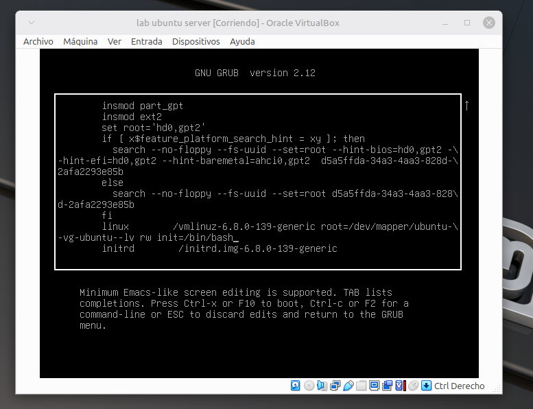
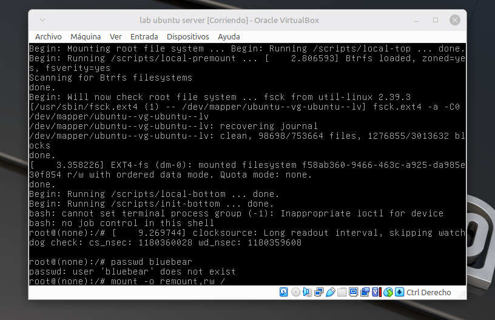
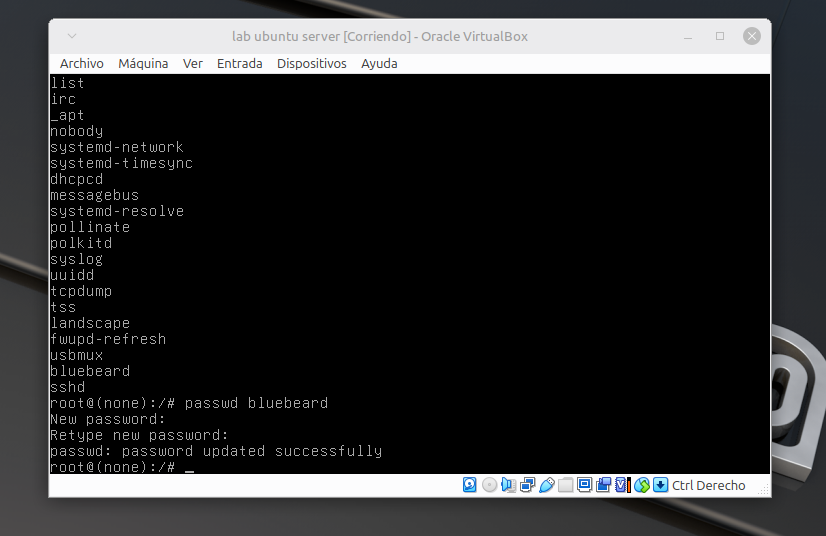

# Resolución de Problemas: Recuperación de Contraseña mediante GRUB

Si perdiste el acceso al servidor o la contraseña configurada en el instalador no es reconocida debido a conflictos con la distribución del teclado, es posible resetear las credenciales interviniendo el gestor de arranque (GRUB).

## Paso a Paso para el Rescate del Sistema

1. **Reiniciar e Intervenir el GRUB:**
   * Reiniciá la máquina virtual desde VirtualBox.
   * Apenas encienda (antes de que aparezca el logo de Ubuntu o cargue el sistema), mantené presionada la tecla **SHIFT** (Mayús) o presioná repetidamente la tecla **ESC** (dependiendo de cómo maneje VirtualBox el arranque). Esto forzará al sistema a mostrar el menú del GRUB.

2. **Editar las Opciones de Arranque:**
   * Posicionate sobre la opción por defecto (generalmente *Ubuntu*) y presioná la tecla **`e`** para editar las líneas de comandos de inicio.


3. **Modificar el Inicializador del Kernel:**
   * Buscá la línea larga que comienza con la palabra **`linux`** ( en mi situacion termina en `ro` lo cual significa **read only**).
   * Desplazate con las flechas del teclado hasta el final de esa línea, borrá las palabras `ro` (o similares) y agregá los siguientes parámetros separados por un espacio:
     ```text
     rw init=/bin/bash     
     ```
   * *¿Qué hace esto?:* Le indica al kernel que monte el disco en modo de **lectura y escritura (`rw`)** y que, en lugar de arrancar el sistema normal con la pantalla de login, nos otorgue directamente una terminal de **Bash con privilegios de Root** sin pedir contraseña.

   <br>



   <br>

4. **Arrancar en Modo Rescate:**
   * Presioná **`Ctrl + X`** para iniciar el servidor con las modificaciones temporales que acabamos de hacer.

5. **Cambiar la Contraseña del Usuario:**
   * El sistema te dejará directamente en una consola que dice `root@(none):/#`.
   * Para cambiar la contraseña de tu usuario personalizado, ejecutá el comando `passwd` seguido de tu nombre de usuario:
     ```bash
     passwd usuario
     ```
   * Escribí la nueva contraseña (por seguridad, te sugiero usar una **ultra simple, corta y en minúsculas** en este paso para evitar problemas de teclado). Dale *Enter* y volvé a confirmarla cuando te lo pida.

6. **Este paso es opcional si no reconoce usuario o no lo recordamos**
   * cuando entramos en GRUB con `rw init=/bin/bash` el Kernel inicia de una forma tan basica que no monta todas las particiones del sistema. Por medio del comando `mount -o remount,rw /` forzamos el montaje correcto de los dicos LVM.
   * antes de ejecutar el comando para cambiar la contraseña nos aseguramos de si el servidor registro al usuario mediante el comando `cut -d: -f1 /etc/passwd` veremos una lista detallada del disco donde debe aparecer el nombre de usuario
   <br>



   <br>

   <br>



   <br>


7. **Reiniciar el Servidor de Forma Segura:**
   * Como entramos saltándonos el inicio normal, no podemos usar el comando `reboot` directamente porque podría corromper datos. Ejecutá estos comandos para sincronizar el disco y forzar el reinicio:
     ```bash
     sync
     reboot -f
     ```